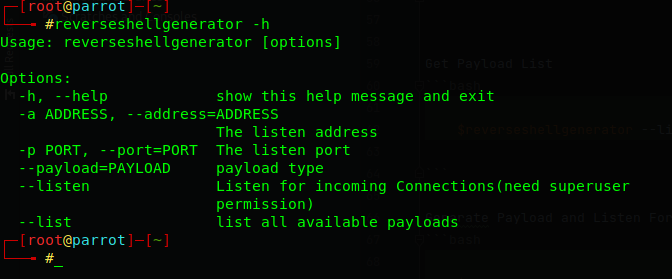
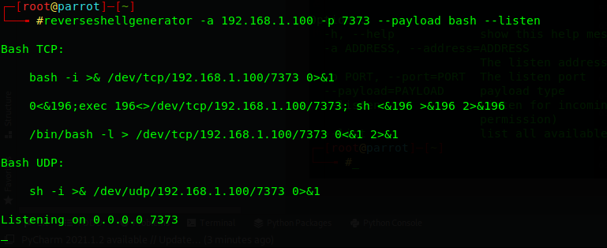
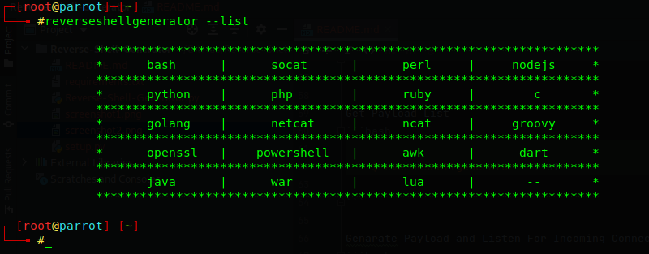

# Reverse Shell Generator 

 - Reverse Shell Generator is command line tool Mostly designed for CTF players 
 - [Reverse Shells From](https://github.com/swisskyrepo/PayloadsAllTheThings/blob/master/Methodology%20and%20Resources/Reverse%20Shell%20Cheatsheet.md)

## Installation & Usage

```bash
    git clone https://github.com/ErushaSandushan/Reverse-Shell-Generator.git
    cd Reverse-Shell-Generator
    sudo python3 setup.py
```

```bash
$./Reverse-Shell-Generator.py 

###############################################################################
#                                                                             #  
#                                                                             #  
#                                                                             #  
#                           REVERSE SHELL GENERATOR                           #      
#                               BY ERUSHA SANDUSHAN                           #
#                                                                             #          
#                                                                             #
#                                                                             #  
#                                                                             #  
############################################################################### 

Usage: Reverse-Shell-Generator.py [options]

Options:
  -h, --help            show this help message and exit
  -a ADDRESS, --address=ADDRESS
                        The listen address
  -p PORT, --port=PORT  The listen port
  --payload=PAYLOAD     payload type
  --listen              Listen for incoming Connections(need superuser
                        permission)
  --list                list all available payloads

```

## Usage Examples

Normal Usage
```bash

    $reverseshellgenerator -a 192.168.1.100 -p 7373 --payload bash  

```
or 
```bash

    $reverseshellgenerator --address 192.168.1.100 --port 7373 --payload bash  

```


Get Payload List
```bash

    $reverseshellgenerator --list

```

Genarate Payload and Listen For Incoming Connection
```bash

    $sudo reverseshellgenerator -a 192.168.1.100 -p 7373 --payload bash --listen

```

## Screenshots






